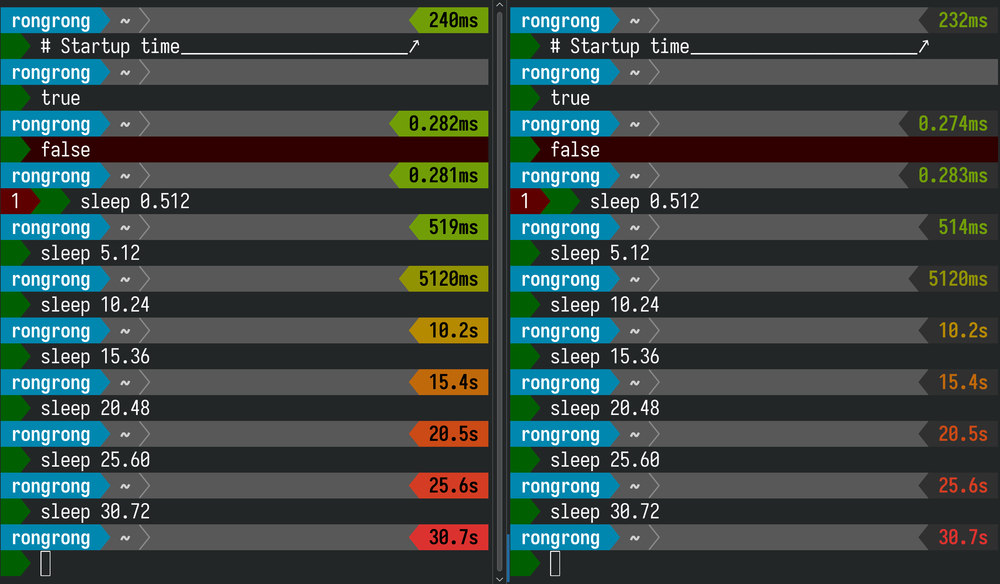

# Powerline Exectime

A Powerline segment to show the execution time of the last command. If configured properly, the startup
time of the shell can be measured as well.



## Installation

You don't need to install this package system-wide as it is enough to install it as a user package.
Thus, do not use `sudo` in the following commands unless you are aware of what you are doing.

```sh
pip install .
```

If `pip` complains that "This environment is externally managed," you may use virtual-env or try this
(again, do not use `sudo` unless you are aware of what you are doing):

```sh
pip install --user --break-system-packages .
```

After installation, restart the Powerline daemon (I assume that your init system is systemd):

```sh
systemctl --user restart powerline-daemon.service
```

## Configuration

### Shell

#### Bash

In `~/.bashrc`, add the following line RIGHT AFTER the line that sources `powerline.sh`:

```bash
source /path/to/powerline_exectime/bindings/bash/powerline-exectime.sh
```

To measure the startup time of Bash, add the following line at the beginning of `~/.bashrc`:

```bash
_POWERLINE_EXECTIME_TIMER_START="${EPOCHREALTIME/[^0-9]/}"
# _POWERLINE_EXECTIME_TIMER_START="$(date +%s%N)"  # for Bash 4 or older
```

If `~/.bashrc` starts with the following lines, the above line should be placed RIGHT AFTER them:

```bash
case $- in
    *i*) ;;
      *) return;;
esac
# ==== INSERT HERE ====
```

If you do all these things correctly, `~/.bashrc` should look like this:

```bash
# something or nothing
case $- in
    *i*) ;;
      *) return;;
esac
_POWERLINE_EXECTIME_TIMER_START="${EPOCHREALTIME/[^0-9]/}"
# _POWERLINE_EXECTIME_TIMER_START="$(date +%s%N)"  # for Bash 4 or older
# do something...
source /usr/share/powerline/bindings/bash/powerline.sh
source /path/to/powerline-exectime/bindings/bash/powerline-exectime.sh
# do something...
```

#### Other Shells

In theory, `powerline-exectime` should work with other shells as well. However, appropriate bindings
are not provided yet. See [TODO](#todo) for more information.

### Segment

In `~/.config/powerline/themes/shell/default.json`, add the `powerline_exectime.exectime` segment.
If the former file does not exist, copy `/usr/share/powerline/config_files/themes/shell/default.json`
before adding the segment.

```json
{
  "function": "powerline_exectime.exectime",
  "args": {
    "threshold": 0.0,
    "significant_figures": 3,
    "max_parts": 2,
    "gradient_range_low": 0.5,
    "gradient_range_high": 30.0,
    "highlight_groups": ["exectime_gradient"]
  },
  "priority": 30
}
```

### Colorschemes

In `~/.config/powerline/colorschemes/default.json`, add `powerline-exectime`-specific colorschemes
(refer to [colorschemes/default.json](colorschemes/default.json)). If the former file does not exist,
just copy the latter one.

## TODO

> Feel free to open an issue or a pull request if you have any idea.

- [ ] Publish to PyPI
- [ ] Add bindings for other shells
- [ ] Make the segment more configurable
- [ ] Make the segment a part of upstream (Powerline)
